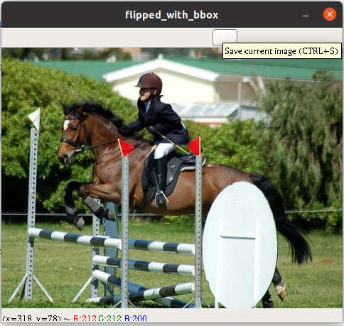
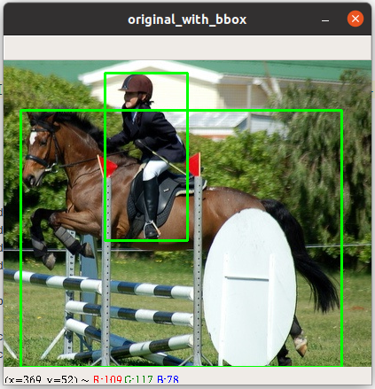
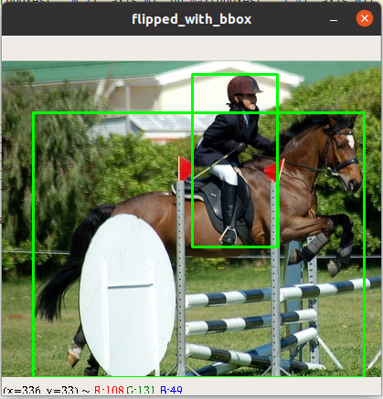
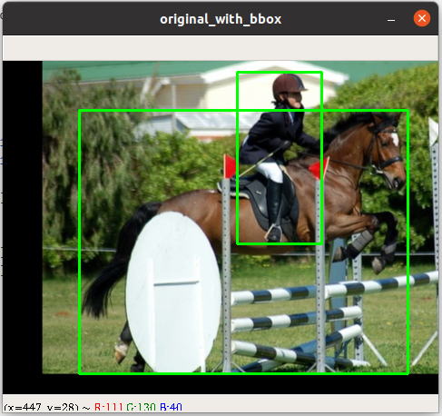
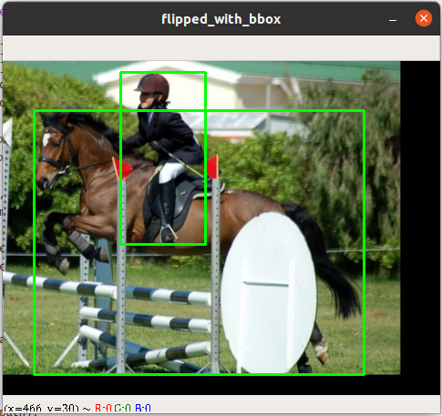
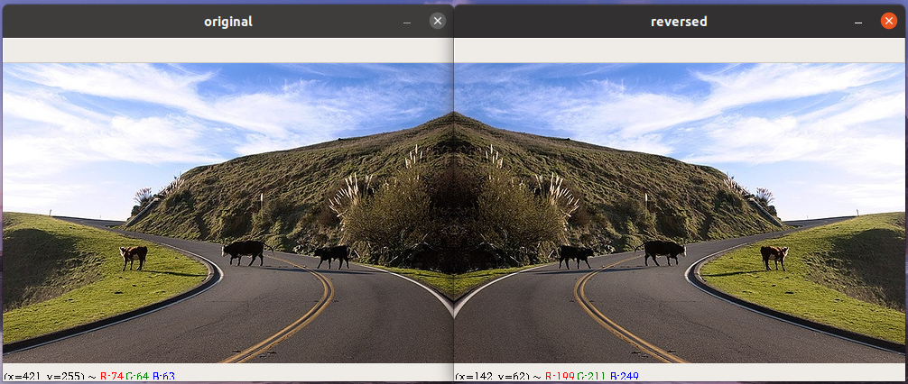
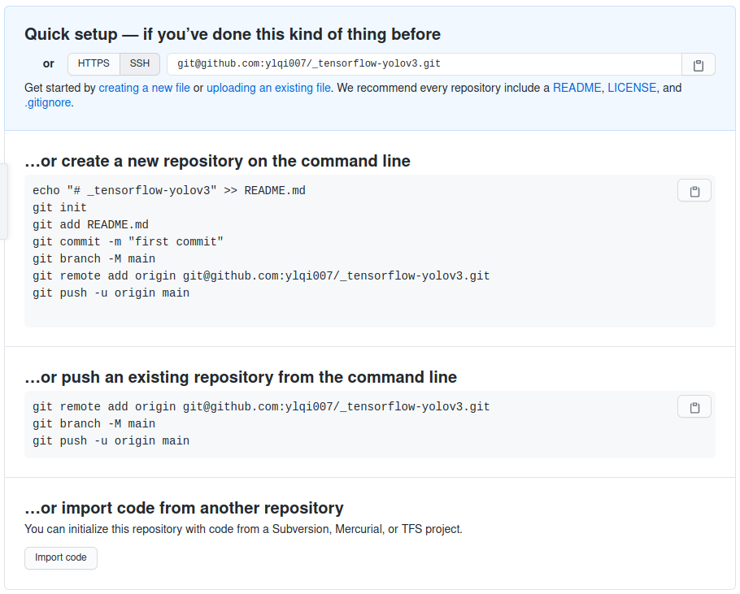

[TOC]

## Project Structure
```
_tensorflow-yolov3/
    |
    |-> core
        |-> dataset.py
```

## TODO
- [x] Prepare dataset and use absolute directories.
- [x] Prepare `voc_train.txt` and `voc_test.txt` with my own image path.
- [x] Parse annot and draw bounding boxes on original image.
    - [x] Cannot draw bounding boxes on flipped image. Why?
    - [x] [Python OpenCV drawing errors after manipulating array with numpy](https://stackoverflow.com/questions/30249053/python-opencv-drawing-errors-after-manipulating-array-with-numpy)
- [ ]


## dataset.py
在用 `python main.py` 进行测试的时候，要注意 `core/config.py` 中 `__C.TRAIN.ANNOT_PATH = "./data/dataset/voc_train.txt"`
而不应该是 `__C.TRAIN.ANNOT_PATH = "../data/dataset/voc_train.txt"`

```python
__C.TRAIN.ANNOT_PATH = "../data/dataset/voc_train.txt"  # Wrong
__C.TRAIN.ANNOT_PATH = "./data/dataset/voc_train.txt"
```
其中 `./data/dataset/voc_train.txt` 是想对于 `_tensorflow-yolov3/` 的路径。       
但是此时是用 YunYang 的 `voc_train.txt` 和 `voc_test.txt`，其中的 `image_path` 并不是我的
image path，所以接下来需要生成我本机的 `voc_train.txt` and `voc_test.txt` 文件。

### Snippet Analyze
#### [dataset.parse_annotation()](https://github.com/YunYang1994/tensorflow-yolov3/blob/add5920130cd8fd9474da6e4d8dd33b24a56524f/core/dataset.py#L154)
```python
bboxes = np.array([list(map(lambda x: int(float(x)), box.split(','))) for box in line[1:]])
```
* `line[1:]` 是一个 sublist，每个 element 代表了一个 truth box 的信息，也就是 `xmin,ymin,xmax,ymax,class_id`.
* `lambda x: int(float(x))`，此 lambda function，先将一个 string argument `x` 映射成 float 类型，再将 float
类型映射成 int 类型。
* `map()` 返回的结果的是一个 `map` object，需要 `list(map object)` 将 `map` object 转换成 list。 

```python
anno = '/home/ylqi007/work/DATA/VOC2007/train/JPEGImages/000017.jpg 185,62,279,199,14 90,78,403,336,12'     # a string
line = anno.split()     # ['/home/ylqi007/work/DATA/VOC2007/train/JPEGImages/000017.jpg', '185,62,279,199,14', '90,78,403,336,12']
img_path = line[0]      # '/home/ylqi007/work/DATA/VOC2007/train/JPEGImages/000017.jpg'
box = line[1]           # '185,62,279,199,14'
box.split(',')          # ['185', '62', '279', '199', '14'], a list of string
res = list(map(lambda x: float(x), box.split(',')))     # [185.0, 62.0, 279.0, 199.0, 14.0], a list of float
res = list(map(lambda x: int(x), list(map(lambda x: float(x), box.split(',')))))    # [185, 62, 279, 199, 14], a list of int
```

#### [random_horizontal_flip()](https://github.com/YunYang1994/tensorflow-yolov3/blob/add5920130cd8fd9474da6e4d8dd33b24a56524f/core/dataset.py#L100)


* Random Flipped Image

#### [random_crop()](https://github.com/YunYang1994/tensorflow-yolov3/blob/add5920130cd8fd9474da6e4d8dd33b24a56524f/core/dataset.py#L109)
```python
max_bbox = np.concatenate([np.min(bboxes[:, 0:2], axis=0), np.max(bboxes[:, 2:4], axis=0)], axis=-1)
```
* `bboxes[:, 0:2]` represents all rows of column 0 and 1;
* `bboxes[:, [0, 2]]` represents all rows of column 0 and 2, without column 1;
* `np.min(bboxes[:, 0:2], axis=0)` represents the min value of `xmin` and min value of `ymin`;
* `np.max(bboxes[:, 2:4], axis=0)` represents the max value of `xmax` and max value of `ymax`;
- [ ] Question here
* `np.concatenate([min_coord, max_coord], axis=-1)`, concatenates the last dim???

```python
image = image[crop_ymin : crop_ymax, crop_xmin : crop_xmax]     # row/col, i.e. y/x
```
* the first dimension is height, i.e. y or rows
* the second dimension is width, i.e. x or columns

 

* Randrom Cropped Image

#### [random_translate()](https://github.com/YunYang1994/tensorflow-yolov3/blob/add5920130cd8fd9474da6e4d8dd33b24a56524f/core/dataset.py#L132)
```python
tx = random.uniform(-(max_l_trans - 1), (max_r_trans - 1))
ty = random.uniform(-(max_u_trans - 1), (max_d_trans - 1))

M = np.array([[1, 0, tx], [0, 1, ty]])
image = cv2.warpAffine(image, M, (w, h))
```
* 将 image 上下左右随机移动，可以移动的范围是 `[tx, ty]`
* Why `(max_l_trans-1)`? 为什么要有 `-1`.


        
* Random translate

### cv2
#### cv2 coordinates
[OpenCV Point(x,y) represent (column,row) or (row,column)](https://stackoverflow.com/questions/25642532/opencv-pointx-y-represent-column-row-or-row-column)

`image = image[:, ::-1, :]`



#### cv2, image display
* [CV01-OpenCV窗口手动关闭后堵塞程序运行的问题](https://jameslei.com/cv01-opencv-cjxbqdb52000b9ys1kjj31yn0)

#### [CV2: Geometric Transformations of Images](https://opencv-python-tutroals.readthedocs.io/en/latest/py_tutorials/py_imgproc/py_geometric_transformations/py_geometric_transformations.html)
* `cv2.warpAffine` and `cv2.warpPerspective`
* **Scaling** Scaling is just resizing of the image. OpecCV comes with a function `cv2.resize()` for this purpose.
    * Scaling factor
    * Interpolation methods: `cv2.INTER_AREA` for shrinking, `cv2.INTER_CUBIC` and `cv2.INTER_LINEAR` for zooming.
* **Translation** Translation is the shifting of object's location. Let the shift in (x, y) direction be (tx, ty),
you can create the transformation matrix **M**.
    * `cv2.warpAfine()` 
* **Rotation** Transformation matrix. OpenCV provides scaled rotation with adjustable center of rotation so that
you can rotate at any location you perfer.
    * `cv2.getRorationMatrix2D`
* **Affine Transformation** In affine transformation, all parallel lines in the original image will still be
parallel in the output image.
    * `cv2.getAffineTransform`
    * `cv2.warpAffine`
* **Perspective Transformation**
    * `cv2.getPerspectiveTransform`
    * `cv2.warpPerspective`
* **Additional Resources:** [“Computer Vision: Algorithms and Applications”, Richard Szeliski]()


---
## GitHub Setup

