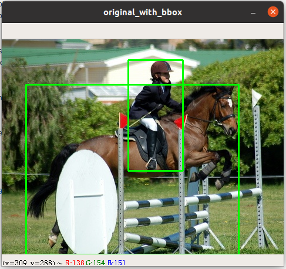

[TOC]

## Project Structure
```
_tensorflow-yolov3/
    |
    |-> core
        |-> dataset.py
```

## TODO
- [x] Prepare dataset and use absolute directories.
- [x] Prepare `voc_train.txt` and `voc_test.txt` with my own image path.
- [x] Parse annot and draw bounding boxes on original image.
    - [ ] Cannot draw bounding boxes on flipped image. Why?
- [ ]





## dataset.py
在用 `python main.py` 进行测试的时候，要注意 `core/config.py` 中 `__C.TRAIN.ANNOT_PATH = "./data/dataset/voc_train.txt"`
而不应该是 `__C.TRAIN.ANNOT_PATH = "../data/dataset/voc_train.txt"`

```python
__C.TRAIN.ANNOT_PATH = "../data/dataset/voc_train.txt"  # Wrong
__C.TRAIN.ANNOT_PATH = "./data/dataset/voc_train.txt"
```
其中 `./data/dataset/voc_train.txt` 是想对于 `_tensorflow-yolov3/` 的路径。       
但是此时是用 YunYang 的 `voc_train.txt` 和 `voc_test.txt`，其中的 `image_path` 并不是我的
image path，所以接下来需要生成我本机的 `voc_train.txt` and `voc_test.txt` 文件。

### Snippet Analyze
[dataset.parse_annotation()](https://github.com/YunYang1994/tensorflow-yolov3/blob/add5920130cd8fd9474da6e4d8dd33b24a56524f/core/dataset.py#L154)
```python
bboxes = np.array([list(map(lambda x: int(float(x)), box.split(','))) for box in line[1:]])
```
* `line[1:]` 是一个 sublist，每个 element 代表了一个 truth box 的信息，也就是 `xmin,ymin,xmax,ymax,class_id`.
* `lambda x: int(float(x))`，此 lambda function，先将一个 string argument `x` 映射成 float 类型，再将 float
类型映射成 int 类型。
* `map()` 返回的结果的是一个 `map` object，需要 `list(map object)` 将 `map` object 转换成 list。 

```python
anno = '/home/ylqi007/work/DATA/VOC2007/train/JPEGImages/000017.jpg 185,62,279,199,14 90,78,403,336,12'     # a string
line = anno.split()     # ['/home/ylqi007/work/DATA/VOC2007/train/JPEGImages/000017.jpg', '185,62,279,199,14', '90,78,403,336,12']
img_path = line[0]      # '/home/ylqi007/work/DATA/VOC2007/train/JPEGImages/000017.jpg'
box = line[1]           # '185,62,279,199,14'
box.split(',')          # ['185', '62', '279', '199', '14'], a list of string
res = list(map(lambda x: float(x), box.split(',')))     # [185.0, 62.0, 279.0, 199.0, 14.0], a list of float
res = list(map(lambda x: int(x), list(map(lambda x: float(x), box.split(',')))))    # [185, 62, 279, 199, 14], a list of int
```

### cv2 coordinates


`image = image[:, ::-1, :]`


### cv2, image display
* [CV01-OpenCV窗口手动关闭后堵塞程序运行的问题](https://jameslei.com/cv01-opencv-cjxbqdb52000b9ys1kjj31yn0)


## GitHub Setup

