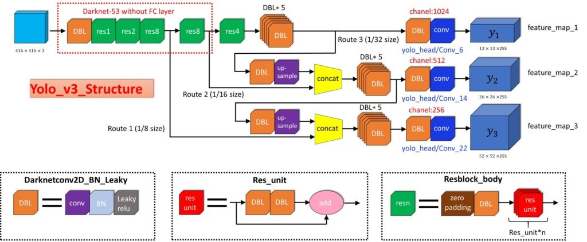

[TOC]

## Project Structure
```
_tensorflow-yolov3/
    |
    |-> core
        |-> dataset.py
```

## TODO
- [x] Prepare dataset and use absolute directories.
- [x] Prepare `voc_train.txt` and `voc_test.txt` with my own image path.
- [x] Parse annot and draw bounding boxes on original image.
    - [x] Cannot draw bounding boxes on flipped image. Why?
    - [x] [Python OpenCV drawing errors after manipulating array with numpy](https://stackoverflow.com/questions/30249053/python-opencv-drawing-errors-after-manipulating-array-with-numpy)
- [ ] `dataset.py/preprocess_true_boxes()`
- [ ] focal loss
- [ ] NMS 处理
- [ ] anchor 响应机制
    - [ ] K-means 聚类
    - [ ] 正负样本分配
- [ ] 损失函数 
    - [ ] 置信度损失
    - [ ] 分类损失
    - [ ] 框回归损失
    - [ ] GIoU
- [ ] 加载与训练模型
    


## dataset.py
在用 `python main.py` 进行测试的时候，要注意 `core/config.py` 中 `__C.TRAIN.ANNOT_PATH = "./data/dataset/voc_train.txt"`
而不应该是 `__C.TRAIN.ANNOT_PATH = "../data/dataset/voc_train.txt"`

```python
__C.TRAIN.ANNOT_PATH = "../data/dataset/voc_train.txt"  # Wrong
__C.TRAIN.ANNOT_PATH = "./data/dataset/voc_train.txt"
```
其中 `./data/dataset/voc_train.txt` 是想对于 `_tensorflow-yolov3/` 的路径。       
但是此时是用 YunYang 的 `voc_train.txt` 和 `voc_test.txt`，其中的 `image_path` 并不是我的
image path，所以接下来需要生成我本机的 `voc_train.txt` and `voc_test.txt` 文件。

### Snippet Analyze
#### [dataset.parse_annotation()](https://github.com/YunYang1994/tensorflow-yolov3/blob/add5920130cd8fd9474da6e4d8dd33b24a56524f/core/dataset.py#L154)
```python
bboxes = np.array([list(map(lambda x: int(float(x)), box.split(','))) for box in line[1:]])
```
* `line[1:]` 是一个 sublist，每个 element 代表了一个 truth box 的信息，也就是 `xmin,ymin,xmax,ymax,class_id`.
* `lambda x: int(float(x))`，此 lambda function，先将一个 string argument `x` 映射成 float 类型，再将 float
类型映射成 int 类型。
* `map()` 返回的结果的是一个 `map` object，需要 `list(map object)` 将 `map` object 转换成 list。 

```python
anno = '/home/ylqi007/work/DATA/VOC2007/train/JPEGImages/000017.jpg 185,62,279,199,14 90,78,403,336,12'     # a string
line = anno.split()     # ['/home/ylqi007/work/DATA/VOC2007/train/JPEGImages/000017.jpg', '185,62,279,199,14', '90,78,403,336,12']
img_path = line[0]      # '/home/ylqi007/work/DATA/VOC2007/train/JPEGImages/000017.jpg'
box = line[1]           # '185,62,279,199,14'
box.split(',')          # ['185', '62', '279', '199', '14'], a list of string
res = list(map(lambda x: float(x), box.split(',')))     # [185.0, 62.0, 279.0, 199.0, 14.0], a list of float
res = list(map(lambda x: int(x), list(map(lambda x: float(x), box.split(',')))))    # [185, 62, 279, 199, 14], a list of int
```

#### [random_horizontal_flip()](https://github.com/YunYang1994/tensorflow-yolov3/blob/add5920130cd8fd9474da6e4d8dd33b24a56524f/core/dataset.py#L100)


* Random Flipped Image

#### [random_crop()](https://github.com/YunYang1994/tensorflow-yolov3/blob/add5920130cd8fd9474da6e4d8dd33b24a56524f/core/dataset.py#L109)
```python
max_bbox = np.concatenate([np.min(bboxes[:, 0:2], axis=0), np.max(bboxes[:, 2:4], axis=0)], axis=-1)
```
* `bboxes[:, 0:2]` represents all rows of column 0 and 1;
* `bboxes[:, [0, 2]]` represents all rows of column 0 and 2, without column 1;
* `np.min(bboxes[:, 0:2], axis=0)` represents the min value of `xmin` and min value of `ymin`;
* `np.max(bboxes[:, 2:4], axis=0)` represents the max value of `xmax` and max value of `ymax`;
- [ ] Question here
* `np.concatenate([min_coord, max_coord], axis=-1)`, concatenates the last dim???

```python
image = image[crop_ymin : crop_ymax, crop_xmin : crop_xmax]     # row/col, i.e. y/x
```
* the first dimension is height, i.e. y or rows
* the second dimension is width, i.e. x or columns

 

* Randrom Cropped Image

#### [random_translate()](https://github.com/YunYang1994/tensorflow-yolov3/blob/add5920130cd8fd9474da6e4d8dd33b24a56524f/core/dataset.py#L132)
```python
tx = random.uniform(-(max_l_trans - 1), (max_r_trans - 1))
ty = random.uniform(-(max_u_trans - 1), (max_d_trans - 1))

M = np.array([[1, 0, tx], [0, 1, ty]])
image = cv2.warpAffine(image, M, (w, h))
```
* 将 image 上下左右随机移动，可以移动的范围是 `[tx, ty]`
* Why `(max_l_trans-1)`? 为什么要有 `-1`.


        
* Random translate

#### [image_preporcess](https://github.com/YunYang1994/tensorflow-yolov3/blob/add5920130cd8fd9474da6e4d8dd33b24a56524f/core/utils.py#L38)


* `cv2.imread()` 返回的是 BGR format 的 ndarray，如果用`cv2` 显示的时候，显示正常，没有问题。此时用 `plt.show()` 则会显示不正常。
* `image = cv2.cvtColor(image, cv2.COLOR_BGR2RGB).astype(np.float32)`, 此时经过 format，image 是 RGB format 的image，则此时用 `cv2.imshow()` 会不正常，而 `plt.show()` 正常。

#### [preprocess_true_boxes](https://github.com/YunYang1994/tensorflow-yolov3/blob/add5920130cd8fd9474da6e4d8dd33b24a56524f/core/dataset.py#L193)
* If the `self.train_input_size = 512`, and `self.strides = np.array([8, 16, 32])`, 
then the `self.train_output_sizes = [64, 32, 16]`, i.e. the original input size (512)
will be divided into `64 x 64` cells.
* `self.anchor_per_scale = 3` means that at each cell there has 3 anchors with different sizes.
* Then the `64 x 64` layer will have `64 x 64 x 3` anchors,
the `32 x 32` layer will have `32 x 32 x 3` anchors,
the `16 x 16` layer will have `16 x 16 x 3` anchors,
all of these three layers have anchors much more than 150.
But only `self.max_bbox_per_scale` in each layer.

##### A bbox sample
```
bbox = [349, 128, 515, 466]         # [xmin, ymin, xmax, ymax], why 515 > 512?
bbox_xywh = [432, 297, 166, 338]    # [x_center, y_center, width, height]
strides = [[8], [16], [32]]
bbox_scaled = [[54.      37.125   20.75    42.25   ]
                [27.      18.5625  10.375   21.125  ]
                [13.5      9.28125  5.1875  10.5625 ]]
anchors_xywh = [[54.5   37.5    1.25   1.625]       # top left corner is (54, 37) in 64x64
                 [27.5   18.5    2.     3.75 ]      # top left corner is (27, 18) in 32x32
                 [13.5    9.5    4.125  2.875]]     # top left corner is (13, 9) in 16x16
                [[54.5    37.5     1.875   3.8125]
                 [27.5    18.5     3.875   2.8125]
                 [13.5     9.5     3.6875  7.4375]]
                [[54.5     37.5      3.625    2.8125 ]
                 [27.5     18.5      4.875    6.1875 ]
                 [13.5      9.5     11.65625 10.1875 ]]
```

```python
label = [np.zeros((self.train_output_sizes[i], self.train_output_sizes[i], self.anchor_per_scale, 5 + self.num_classes)) for i in range(3)]
bboxes_xywh = [np.zeros((self.max_bbox_per_scale, 4)) for _ in range(3)]
bbox_count = np.zeros((3,))
```
* Supporse input_size = 512, stides = [8, 16, 32] ==> output_size = [64, 32, 16]
* `label`: [Shape(64, 64, 3, 25), Shape(32, 32, 3, 25), Shape(16, 16, 3, 25)]
    * `64x64`, i.e. 将 512x512 的 image 缩小8倍得到的大小，也就是 64x64 的 cells；
    * `3`，是指每个 cell 位置上有 3 个 anchor，没别对应不同的大小和长宽比例；
    * `25`，[:4] 对应这个 object truth box 的 position `(xc, yc, w, h)`, [4] 对应是否有 object，[5:] 对应每个 class 的 initial possibility。
    * 在 `3` 个 anchors 中，只有与 bbox 的 IoU 大于 0.3 的时候，才考虑下个维度的数，也就是 `[25]` 这个维度。 
* `bboxes_xywh`: [Shape(3, 4), Shape(3, 4), Shape(3, 4)]
* `bbox_count`: np.zeros((3,)), 统计每个 scale 上 bbox？
* `if np.any(iou_mask):`    说明 `bbox_xywh_scaled[i]` 与当前的 `anchor` 有交叠。

### `__next__(self)`

* `return batch_image, batch_label_sbbox, batch_label_mbbox, batch_label_lbbox, batch_sbboxes, batch_mbboxes, batch_lbboxes`
* `batch_image` : [batch, InputSize, InputSize, 3], inputSize=[320, 352, ..., 618]
* `batch_label_sbbox` : [batch, train_output_size[0], train_output_size[0], anchor_per_scale, 5+num_classes], train_output_size[0] = inputSize / 8, anchor_per_scale=3
* `batch_label_mbbox` : [batch, train_output_size[1], tran_output_size[1], anchor_per_scale, 5+num_classes], train_output_size[1] = inputSize / 16, anchor_per_scale=3
* `batch_label_lbbox` : [batch, train_output_size[2], tran_output_size[2], anchor_per_scale, 5+num_classes], train_output_size[2] = inputSize / 32, anchor_per_scale=3  
* `batch_sbboxes` : [batch, max_bbox_scale, 4]  = [batch, 150, 4]
* `batch_mbboxes` : [batch, max_bbox_scale, 4]  = [batch, 150, 4]
* `batch_lbboxes` : [batch, max_bbox_scale, 4]  = [batch, 150, 4]


### cv2
#### cv2 coordinates
[OpenCV Point(x,y) represent (column,row) or (row,column)](https://stackoverflow.com/questions/25642532/opencv-pointx-y-represent-column-row-or-row-column)

`image = image[:, ::-1, :]`


#### cv2, image display
* [CV01-OpenCV窗口手动关闭后堵塞程序运行的问题](https://jameslei.com/cv01-opencv-cjxbqdb52000b9ys1kjj31yn0)

#### [CV2: Geometric Transformations of Images](https://opencv-python-tutroals.readthedocs.io/en/latest/py_tutorials/py_imgproc/py_geometric_transformations/py_geometric_transformations.html)
* `cv2.warpAffine` and `cv2.warpPerspective`
* **Scaling** Scaling is just resizing of the image. OpecCV comes with a function `cv2.resize()` for this purpose.
    * Scaling factor
    * Interpolation methods: `cv2.INTER_AREA` for shrinking, `cv2.INTER_CUBIC` and `cv2.INTER_LINEAR` for zooming.
* **Translation** Translation is the shifting of object's location. Let the shift in (x, y) direction be (tx, ty),
you can create the transformation matrix **M**.
    * `cv2.warpAfine()` 
* **Rotation** Transformation matrix. OpenCV provides scaled rotation with adjustable center of rotation so that
you can rotate at any location you perfer.
    * `cv2.getRorationMatrix2D`
* **Affine Transformation** In affine transformation, all parallel lines in the original image will still be
parallel in the output image.
    * `cv2.getAffineTransform`
    * `cv2.warpAffine`
* **Perspective Transformation**
    * `cv2.getPerspectiveTransform`
    * `cv2.warpPerspective`
* **Additional Resources:** [“Computer Vision: Algorithms and Applications”, Richard Szeliski]()


---

---

### [focal_loss](https://github.com/YunYang1994/tensorflow-yolov3/blob/add5920130cd8fd9474da6e4d8dd33b24a56524f/core/yolov3.py#L131)


## [core/common.py]()
### How to calculate paddings?
There are various layers in CNN network:
* **Input Layer:** All the input layer does is ready the image. So, there are not parameters 
to learn in here.
* **Convolutional Layer:** Consider a convolutional layer which takes "l" feature maps as the input 
and has "k" feature maps as output. The filter size is "n*m".
* **Fully-connected Layer:** In this layer, all input units have a separable weight to each output 
unit. For `n` inputs and `m` outputs, the number of weights is `n * m`. Additionally, this layer 
has the bias for each output node, so `(n + 1) * m` parameters.
* **Output Layer:** This layer is the fully connected layer, so "(n+1)m" parameters, when "n" is 
the number of inputs and "m" is the number of outputs.

### [common.py/convolutional()](https://github.com/YunYang1994/tensorflow-yolov3/blob/add5920130cd8fd9474da6e4d8dd33b24a56524f/core/common.py#L17)
* `paddings = tf.constant([[0, 0], [pad_h, pad_h], [pad_w, pad_w], [0, 0]])`
    Regarding the correspondence between tensor and paddings, first their rank needs to be constant.
    Suppose the shape of tensors in `[B, H, W, C]`, which is the batch, height, width, channel.
    Generally speaking, there is no need for pads for dimensions B and C. You only need to operate 
    on H and W dimensions, so the shape of the corresponding paddings is `[[0, 0], [H_top
    , H_bottom], [W_left, W_right], [0, 0]]`.
    The H dimension can be understood as the row dimension, and the W dimension is the column 
    dimension.
    
#### TODO
* tf.constant()
* tf.pad()
* tf.get_variable()
* tf.nn.conv2d()
* tf.layers.batch_normalization()
* tf.nn.bias_add()
* tf.nn.leaky_relu()
* [common.py/residual_block()]()


References:
* [6.3. Padding and Stride](https://d2l.ai/chapter_convolutional-neural-networks/padding-and-strides.html)
* [What is the difference between 'SAME' and 'VALID' padding in tf.nn.max_pool of tensorflow?](https://stackoverflow.com/questions/37674306/what-is-the-difference-between-same-and-valid-padding-in-tf-nn-max-pool-of-t)
* [A guide to convolution arithmetic for deep learning](https://arxiv.org/pdf/1603.07285v1.pdf)
* [tf.pad(tensor, paddings, mode='CONSTANT')](https://www.programmersought.com/article/85861218450/)
### 


---
## Convolution
We can compute the spatial size of the output volume as a function of:  

    * the input volume size (`W`)
    * the receptive field size of the Conv Layer (`F`)
    * the stride with which they are applied (`S`)
    * the amount of zero padding used on the border (`P`).          

`outputSize = (W - F + 2P) / S + 1`

**Use of zero-padding:** In general, setting zero padding to be `P = (F - 1) / 2` when the stride
is `S = 1` ensures that the input volume and output volume will have the same size spatially.
也就是当 `S = 1` 的时候，并且 `P = (F - 1) / 2`，则 outputSize 与 inputSize 相同。
It is very common to use zero-padding in this way.

**Constraints on strides:** Note again that the spatial arrangement hyperparameters have mutual 
constraints. If `outputSize = (W - F + 2P) / S + 1 = (10 - 3 + 2 * 0) / 2 + 1 = 4.5`, this setting 
of the hyperparameters is considered to be invalid, and a ConvNet library could throw an exception 
or zero pad the rest to make it fit, or crop the input to make it fit, or something.

**Summary** To summarize the Conv Layer:            
* Accepts a volume of size `W1 x H1 x D1`, i.e. the input size
* Required four hyperparameters:
    * number of filters `K`,
    * their spatial extent `F`,
    * the stride `S`,
    * the amount of zero padding `P`.
* Produces a volume of size `W2 x H2 x D2` where:
    * `W2 = (W1 - F + 2P) / S + 1`
    * `H2 = (H1 - F + 2P) / S + 1` (i.e. width and height are computed equally by symmetry)
    * `D2 = K` (i.e. the number of filers)
* With parameter sharing, it introduces `F x F x D1` weights per filter, for a total of `F x F x 
D1) x K` weights and `K` biases.
* In the output volume, the `d-th` depth slice (of size `W2 x H2`) is the result of performing a 
valid convolution of the `d-th` filter over the input volume with a stride of `S`, and then offset 
by `d-th` bias.
* A common setting of the hyperparameters is `F=3, S=1, P=1`.

* The height or width of the output image, calculated from these equations, might be a non-integer 
value. In that case, you might want to handle the situation in any way to satisfy the desired 
output dimension. The spatial semantics of the convolution ops depend on the padding scheme chosen: 
`SAME` or `VALID`. Note that the padding values are always zero.
* Let's assume that the 4D input has shape `[batch_size, input_height, input_width, input_depth]`, 
and the 4D filter has shape `[filter_height, filter_width, filter_depth, number_of_filters]`. Here, 
the number of channels (depth) in input image must be the same with depth of the filter, meaning 
`input_depth = filter_depth`.
* First, let's consider `SAME` padding scheme. The output height and width are computed as:
`H2 = ceiling(H1 / Sh), W2 = ceiling(W2 / Sw)`. Here is how TensorFlow calculates the required 
total padding, applied along the height and width:
    ```
    if H1 % Sh == 0:
        Ph = max(Fh - Sh, 0)    # Padding along height
    else:
        Ph = max(Fh - (H1 % Sh), 0)
  
    if W1 % Sw == 0:
        Pw = max(Fw - Sw, 0)    # Padding along width
    else:
        Pw = max(Fw - (W1 % Sw), 0)
  
    # Finally, the padding on the top/bottom and left/right are:
    Pt = flooring(Ph / 2),  Pb = Ph - Pt
    Pl = flooring(Pw / 2),  Pr = Pw - Pl
    ```
* For example, when `padding along height` is 5, we pad 2 pixels at the top and 3 pixels at the
bottom.
* In the `VALID` padding scheme which we do not add any zero padding to the input, the size of the 
output would be:
    * `H2 = ceiling((H1 - Fh + 1) / Sh)`
    * `W2 = ceiling((W2 - Fw + 1) / Sw)`
* Image size = `img_height x img_width x img_depth`. A grayscale image has 1 channel (such as 
infamous MNIST dataset), a color image has 3 channles (such as RGB image).

References:
* [Convolutional Neural Networks (CNNs / ConvNets)](https://cs231n.github.io/convolutional-networks/)
* [Autoencoder: Downsampling and Upsampling](https://kharshit.github.io/blog/2019/02/15/autoencoder-downsampling-and-upsampling)
* [Helper - numpy.pad upsample/downsample](https://www.kaggle.com/yuooka/helper-numpy-pad-upsample-downsample)
* [A Gentle Introduction to Padding and Stride for Convolutional Neural Networks](https://machinelearningmastery.com/padding-and-stride-for-convolutional-neural-networks/)
* [下采样卷积手动padding部分如何推导 #437](https://github.com/YunYang1994/tensorflow-yolov3/issues/437)
* [卷积运算中，在stride>1时，关于conv2d的padding的问题。 #355](https://github.com/YunYang1994/tensorflow-yolov3/issues/355)
* [What does the "same" padding parameter in convolution mean in TensorFlow?](https://www.quora.com/What-does-the-same-padding-parameter-in-convolution-mean-in-TensorFlow)
* [Implementing 'SAME' and 'VALID' padding of Tensorflow in Python](https://mmuratarat.github.io/2019-01-17/implementing-padding-schemes-of-tensorflow-in-python)


---
## YOLOv3 Arch




### [common.py/convolutional()](https://github.com/YunYang1994/tensorflow-yolov3/blob/add5920130cd8fd9474da6e4d8dd33b24a56524f/core/common.py#L17)
```python
def convolutional(input_data, filters_shape, trainable, name, downsample=False, activate=True, bn=True):

    with tf.variable_scope(name):
        if downsample:
            pad_h, pad_w = (filters_shape[0] - 2) // 2 + 1, (filters_shape[1] - 2) // 2 + 1
            paddings = tf.constant([[0, 0], [pad_h, pad_h], [pad_w, pad_w], [0, 0]])
            input_data = tf.pad(input_data, paddings, 'CONSTANT')
            strides = (1, 2, 2, 1)
            padding = 'VALID'
        else:
            strides = (1, 1, 1, 1)
            padding = "SAME"

        weight = tf.get_variable(name='weight', dtype=tf.float32, trainable=True,
                                 shape=filters_shape, initializer=tf.random_normal_initializer(stddev=0.01))
        conv = tf.nn.conv2d(input=input_data, filter=weight, strides=strides, padding=padding)

        if bn:
            conv = tf.layers.batch_normalization(conv, beta_initializer=tf.zeros_initializer(),
                                                 gamma_initializer=tf.ones_initializer(),
                                                 moving_mean_initializer=tf.zeros_initializer(),
                                                 moving_variance_initializer=tf.ones_initializer(), training=trainable)
        else:
            bias = tf.get_variable(name='bias', shape=filters_shape[-1], trainable=True,
                                   dtype=tf.float32, initializer=tf.constant_initializer(0.0))
            conv = tf.nn.bias_add(conv, bias)

        if activate == True: conv = tf.nn.leaky_relu(conv, alpha=0.1)

    return conv
```
* Downsample or Not
    * `conv = tf.nn.conv2d(input=input_data, filter=weight, strides=strides, padding=padding)`
    * `downsample == False`, i.e. `strides=(1, 1, 1, 1)` and `padding="SAME"`, then the output 
    of Conv2D should have the same size with the input in height and width.
    * `downsample == True`, i.e. `strides=(1, 2, 2, 1)` and `padidng="VALID"`, then the output
    of Conv@D should be half of the input size in height and width.
    * 需要 downsample 的时候，在 width/height 方向上，`stride=2`,此时 `output_HW = intput_HW/2`;
    不需要 downsample 的时候，在 width/height 方向上，`stride=1`.
* `SAME` vs `VALID`
    * In `SAME` padding scheme, the output have the same height and width with the input.
    * In `VALID` padding scheme, we do not add any zero padding to the input, i.e. `P = 0`.
    * 在需要 downsample 的时候，采用 `VALID` padding，则调用卷积函数的时候，不会自动进行 zero padding，
    所以需要手动 padding。
* **Downsample**
    * 在 conv 过程中，总共 5 次 downsample，也就是 inputSize 至少是 32 的倍数,
    therefore, `__C.TRAIN.INPUT_SIZE = [320, 352, 384, 416, 448, 480, 512, 544, 576, 608]`.
    * 此时需要 outputSize 是 inputSize 的一半, `(W - F + 2P)/2 + 1 = (W - 3 + 2)/2 + 1 = W / 2`,
    此时 W 是偶数，`(W - 1) / 2` 比 `W/2` 小 1,则 `（W-1)/2 + 1` 恰好为 `W/2`.
* `weight = tf.get_variable(name='weight', dtype=tf.float32, trainable=True,
                            shape=filters_shape, initializer=tf.random_normal_initializer(stddev=0.01))`
    * `shape = filters_shape`, i.e. `[filter_height, filter_width, filter_depth, num_of_filters]`,
    此时 filter_shape 是在创建 Conv Layer 的时候确定的。
    * `initializer=tf.random_normal_initializer(stddev=0.01)`, 初始化 weight 的众多方法。
* `input_data = tf.pad(input_data, paddings, 'CONSTANT')`
    * [tf.pad](https://www.tensorflow.org/api_docs/python/tf/pad)
    * `"CONSTANT"`
* `tf.layers.batch_normalization()`


### [def decode()](https://github.com/YunYang1994/tensorflow-yolov3/blob/add5920130cd8fd9474da6e4d8dd33b24a56524f/core/yolov3.py#L97)

文章原文如下：


* The network predicts 4 coordinates for **each bounding box**, tx, ty, tw, th.
* The cell is offset from the top left corner of the image by (cx, cy) and the bounding box prior has width and height pw, ph, then the predictions corresponds to: bx, by, bw, bh
* YOLOv3 predicts an objectness score for **each bounding box** using logistic regression. This should be 1 if the bounding box prior overlaps a **ground truth object** by more than any other bounding box prior. If the bounding box prior is not the best but does overlap a ground truth object by more than some threshold we ignore the prediction. 多个满足条件的 bounding box prior，只选最好的。Our system only assigns one bounding box prior for each ground truth object. If a bounding box prior is not assigned to a ground truth object it incurs no loss for coordinate or class predictions, only objectness. 

名词解释：
1. **anchor box (bounding box prior)** anchor box 最初是由 Faster RCNN 引入的。anchor box (论文中也
称为 bounding box prior，后面均使用 anchor box) 其实是从训练集的所有 ground truth box 中的统计出来的几个
比较具有代表性的 boxes。在训练的时候，可以先将这些先验经验加入到模型中，这样模型在学习的时候就减小了随机瞎找
的概率，当然就有助于模型收敛。

## GIOU
- [ ] TODO

## References:
* [YOLOv3 算法的一点理解](https://yunyang1994.github.io/2018/12/28/YOLOv3/)
* [目标检测3: yolov3结构原理，boundingbox边框回归](https://blog.csdn.net/u010397980/article/details/85058630)
* [揭秘YOLOv3鲜为人知的关键细节](https://zhuanlan.zhihu.com/p/50595699)
* [超详细的Yolov3边框预测分析](https://zhuanlan.zhihu.com/p/49995236)
* [关于YOLOv3的一些细节](https://www.jianshu.com/p/86b8208f634f)
* [Why does Faster R-CNN use anchor boxes?](https://www.quora.com/Why-does-Faster-R-CNN-use-anchor-boxes)
* [bbox_loss_scale的作用 #459](https://github.com/YunYang1994/tensorflow-yolov3/issues/459)
